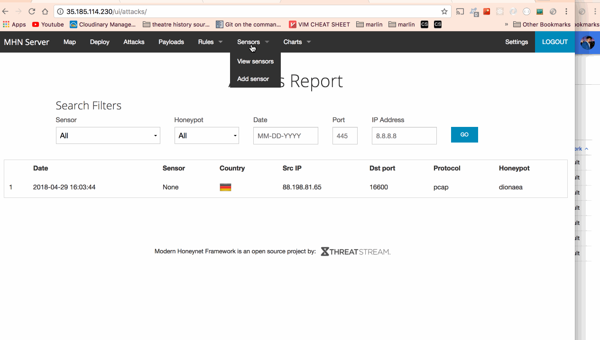

# Project 9 - Honeypot

Time spent: 5 hours spent in total and more to leave the honeypot active

> Objective: To allow honeypot to be active and intercept some attempted attacks.

## Which Honeypot(s) you deployed

* Dionaea over HTTP
* Snort

## Any issues I've encountered

none 

## A summary of the data collected:

Number of attacks for Dionaea of HTTP: 1 at the time of writing this README

Number of attacks for Dionaea of HTTP: 0 at the time of writing this README

## Any unresolved questions raised by the data collected

For Dionaea over HTTP honeycomb, there was only one attack listed
and none for snort

## GIF of Admin Panel

## Resources

- [MHN](https://github.com/threatstream/mhn)
